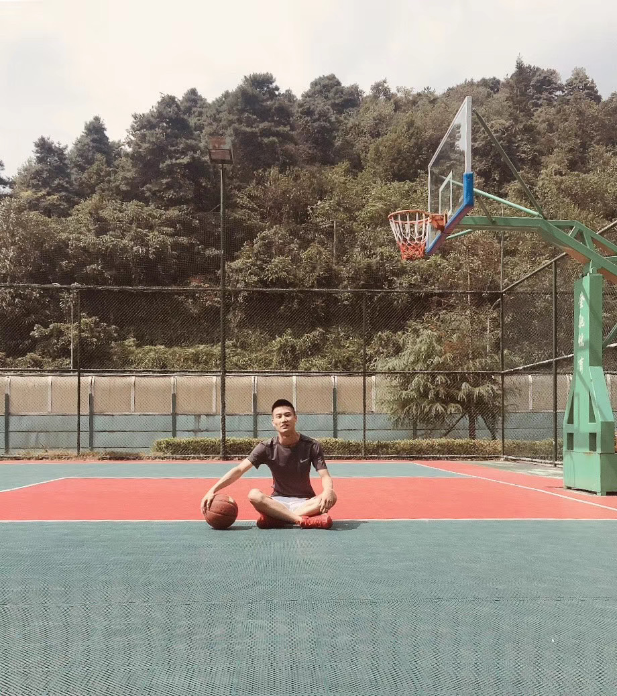

### 软件开发工程师
&emsp;&emsp;继续爱心，继续大度；我会像对待我的代码一样对待"你"，我的代码怎么可能有问题，我的代码是没有错的，就算有错也是由我来改！
<!-- 
 -->
  <!--  -->
<!-- 
 -->
<!--  -->
### 技能：
- java: SpringBoot SpringMVC SpringCloud
- 数据库：MySql Redis PostGis MongoDB Mybatis
- 中间件：RabbitMQ ...
- PC端:Angularjs Vuejs ReactJs
- 移动端：ReactNative Flutter Ionic
- 桌面端：Electorn
- 接口规范：Rest GraphQL
- 微信（小程序）：Taro MapVue
- 微信（服务号、订阅号）：TouchUI WeUI
- WebGIS: Openlayers Arcgis Api For Javascript Cesiumjs
- 地图服务：Geoserver SuperMap ArcGisEngine
- 包管理工具（后端）：Maven Gradle
- 包管理工具（前端）：Npm Webpack Yarn Lerna Grunt
- Node: Koa2 Express Eggjs Nestjs
- SPA-SEO/SSR: Nuxtjs Nextjs Angulr-Universal 
- 部署：Gitlab Jenkins Docker
- Cloud: HuaWei Aliyun Tencent Sanfengyun

### 我的：
- 个人博客：https://it-ing.cn
- 个人网站前台：https://art-alive.cn
- 个人网站接口：https://pi.art-alive.cn
- 个人网站后台：https://admin.art-alive.cn
- 个性网站：https://h5.art-alive.cn
- 其它：https://iting.life
- ......持续跟新中......

